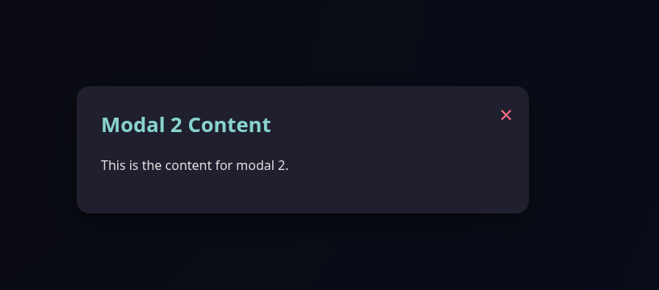

# 🧠 SynapseModalFX

> **Smart minds create smart modals.**  
> This project brings 3 clean and interactive modal windows, built using HTML, CSS, and JavaScript — with smooth animations and multi-modal logic.

---

## 💡 What does "SynapseModalFX" mean?

- **Synapse**: A word from neuroscience. A "synapse" connects brain cells — just like this project connects UI with logic!
- **Modal**: Popup boxes or overlays in a web app.
- **FX**: Short for "effects" — cool animations and interactivity!

So, *SynapseModalFX* = Intelligent + Beautiful + Futuristic Modal System.  

---

## 🎯 Features

- 🔘 Three Stylish Modals
- ❎ Click outside or press ESC to close
- 🧠 Clean UI, modern layout
- 💡 Lightweight, no frameworks used

---

## 🛠️ Tech Stack

- HTML5
- CSS3 (Flexbox-based layout)
- Vanilla JavaScript

---

## 📸 Preview


⬇️ **Another View** ⬇️




## 📂 File Structure
```
SynapseModalFX/
├── index.html
├── style.css
├── script.js
├── images/
│   ├── Demo1.png
│   └── Demo2.png
├── README.md
└── favicon.jpeg
```


## 🚀 How to Use

1. Clone the repository:

```bash
git clone https://github.com/HasibCoderLab/SynapseModalFX.git
cd SynapseModalFX
```
2. Open index.html in your browser.

3.Click any button to see the modal in action.

4.Close with the ❌ button, background click, or ESC key.

---

## 🙌 Author

Made with 💻 by [Mohammad Hasib Hasan](https://github.com/HasibCoderLab)

### 🌐 Connect with me:

- 🔗 [GitHub](https://github.com/HasibCoderLab)
- 🎥 [YouTube - CodeFusionary](https://www.youtube.com/@CodeFusionary)
- 💼 [LinkedIn](https://www.linkedin.com/in/mohammadhasibhasan)
- 📷 [Instagram](https://www.instagram.com/mohammadhasibhasan)
- 💡 [LeetCode](https://leetcode.com/Coderboyhasib)
- 🧠 [Codeforces](https://codeforces.com/profile/Coderhasib)
